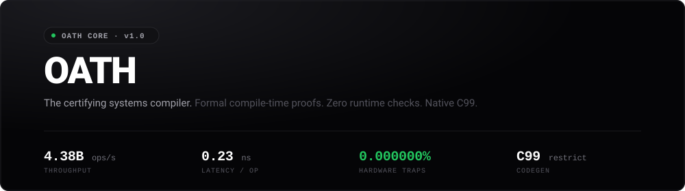



# OATH

OATH is a certifying systems compiler that proves memory safety, arithmetic boundedness, and functional contracts at compile time. It emits branchless, vectorizable C99 code with zero runtime checks.

Verification executes in-process using an embedded abstract interpreter and Difference Bound Matrix (DBM) solver without external SMT solvers (Z3) or proof assistants.

## Measured Performance

Hardware execution on x86_64 (10,000,000 iterations, hardware memory barrier enforced):

    Target        : net_pipeline_benchmark()
    Total Time    : 2.28 ms
    Latency       : 0.23 ns / op
    Throughput    : 4,379,242,391 ops/sec
    Runtime Checks: 0 (100% compile-time eliminated)
    Safety Proof  : Formally verified sound

## Guarantees

- Trap Freedom: Integer overflow, underflow, division-by-zero, and the x86 #DE 64-bit sign trap (INT64_MIN / -1) are statically proven unreachable.
- Memory Safety: Bounds for static arrays and dynamic slices (buf[idx]) are proven via relational inequalities. Off-by-one errors are rejected at compile time.
- Separation Logic: Pointer aliasing is verified via `requires disjoint(src, dst)`. Overlapping buffers passed to mutating functions are rejected at call sites. Emits C99 restrict pointers.
- Relational Domain: DBM solver maintains relative differences (v_i - v_j <= c) with Floyd-Warshall transitive closure, eliminating false-positive underflow errors in operations like balance - amount.
- Linear Resource Safety: Heap allocations (alloc/free) must be balanced on all execution paths. Memory leaks and double-free errors are rejected at compile time.
- Exhaustive Sum Types: Enums and pattern matching compile down to zero-cost jump tables (switch). Unhandled variants trigger compile errors.

## CLI Usage

    # Verify source and emit C99
    oath test.oath

    # Verify, transpile via Clang -O3, and execute native binary
    oath run test.oath

    # Execute 10,000,000-iteration hardware microbenchmark
    oath bench test.oath

    # Emit C header, source, and audit certificate
    oath lib test.oath -o netring

## Generated Artifacts

Executing `oath lib <file.oath> -o <prefix>` outputs:
- <prefix>.h: Standalone C99/C++ header with Doxygen formal contract bounds.
- <prefix>.c: Raw C99 source with restrict annotations and zero runtime panic branches.
- <prefix>.audit.json: Machine-verifiable certificate for compliance audits (ISO 26262, DO-178C).
